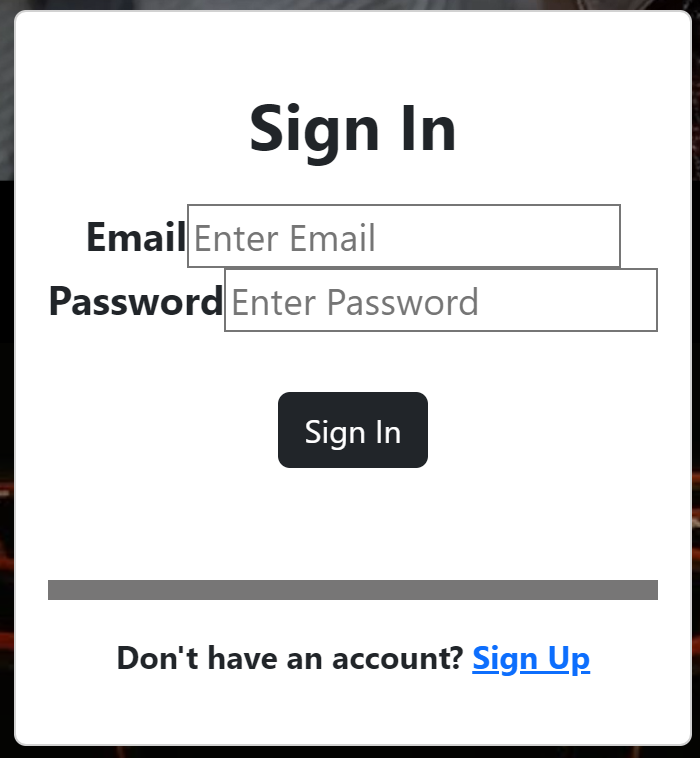
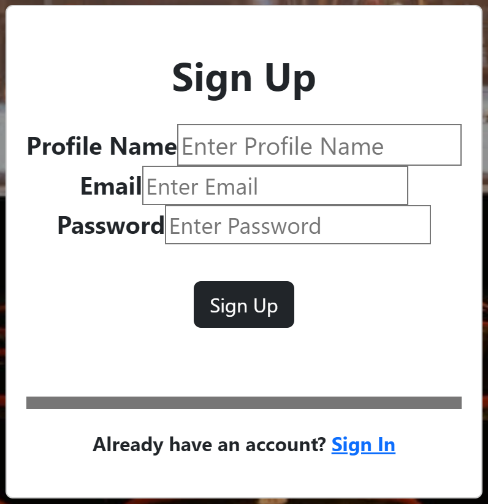
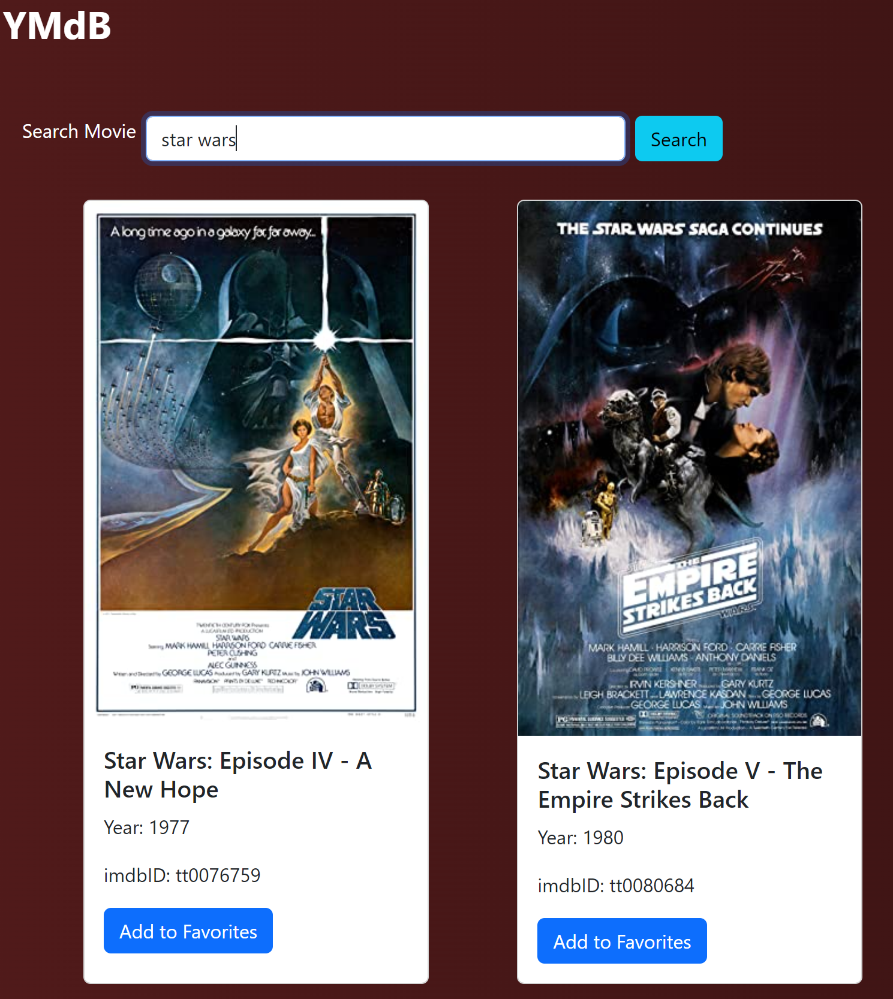
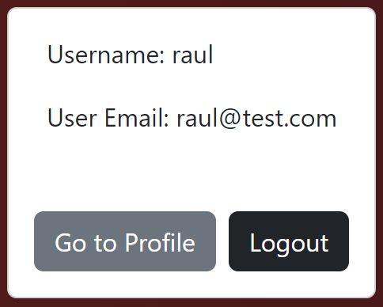
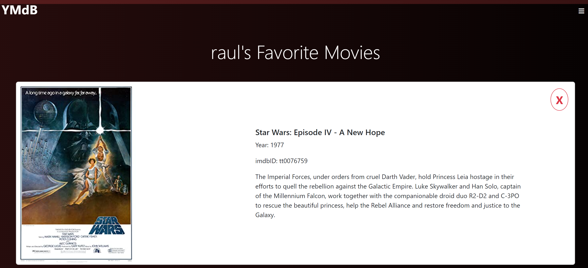
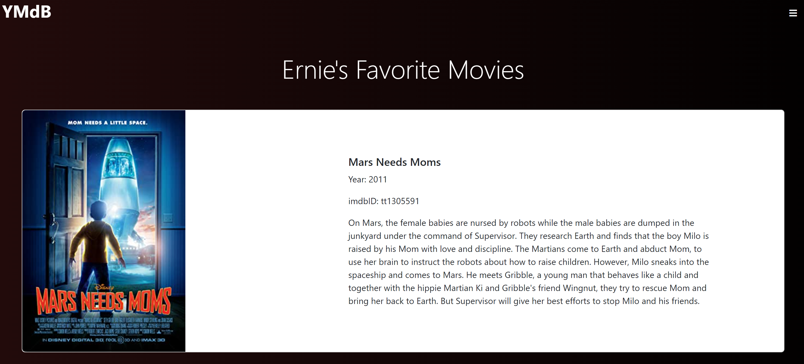
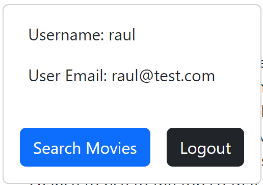
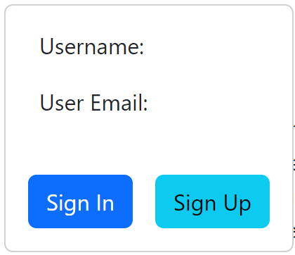

# My Favorite Movies App

  <a
    href="https://4g-final-group-project.vercel.app/"
  >
    Link to Live Website
  </a>

Our website is an app where a user can sign up and keep track of their favorite movies. It uses the api from <a href="https://www.omdbapi.com/">OMDb API</a>. A user can also share with others what their favorite movies are by sharing their profile name.
  
Users' favorite movies are not stored locally. They are stored using <a href="https://firebase.google.com/">firebase</a>.

## Functionality

#### Sign-in / Sign-up

A user can sign in by clicking on the menu icon in the top right. That will bring up a sign in modal. If a user does not have an account, then can click on sign up which will bring up a sign up modal. A user can then sign up with an email address and profile name.

#### Search and Add Favorite Movies

If a sign in or sign up is successful, a user will be taken to a page where they can search for movies by name and add them to their favorites. Only registered users can access this page.

#### Go To Profile

To see their favorite movies, a user can click on the menu button in the top right which will bring up a modal allowing a user to go to their profile page or logout.

#### Profile Signed In

A user's profile page follows the path: /profile/{profile name}
 
If a user is signed in, they can see all of the movies they have selected as well as remove any movies by clicking on the red X on the top right of each movie card.

#### Profile Signed Out

Anybody can access another user's profile page by following the /profile/{profile name} path. However, users or other non-members of the site do not have the ability to delete another user's movies.

#### Go To Search

If a user is signed in, regardless if they are on their profile page or not, they can search for movies again by clicking on the menu button in the top right and then clicking on the Search Movies button.

If a user is not signed in or is not a registered member of the site, then a user is prompted to sign in or sign up.

